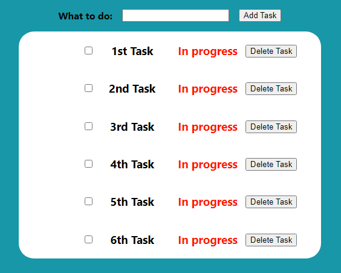

# Todo List App

This is a fullstack todo list application built using React.js on the front-end,
Express.js for the API, and MySQL as the database.



## Installation

Install the latest version of Node.js: https://nodejs.org/en/

Install the latest version of MySQL Community Server: https://dev.mysql.com/downloads/mysql/

Clone this repository using commands in your terminal:
### git clone URL

Next, cd into the project directory.

Once, inside, run these commands:

### npm install
### cd todo-list-express
### npm install

This will install all the dependencies needed for the project to run.

## Configure credentials for your database

Before we can start up the application, we will need to configure the database.js file.
This file is located in the "todo-list-express" sub-directory.
Open the file using your choice of code editor.

Fill in your credentials in this code block:
```
let db = mysql.createConnection({
    host: '127.0.0.1',
    port: '3306',
    user: '',
    password: '',
    database: 'todolist',
});
```

The host and port that are pre-entered are the defaults when install MySQL server.
The database name should correspond with the one you create for this project.

## To start the application:

In your terminal, cd to the main directory of the project and enter this command:

### npm start

Runs the app in development mode.
Open http://localhost:3000 to view the app in your browser.

You can press Ctrl + C to stop the instance of the app.